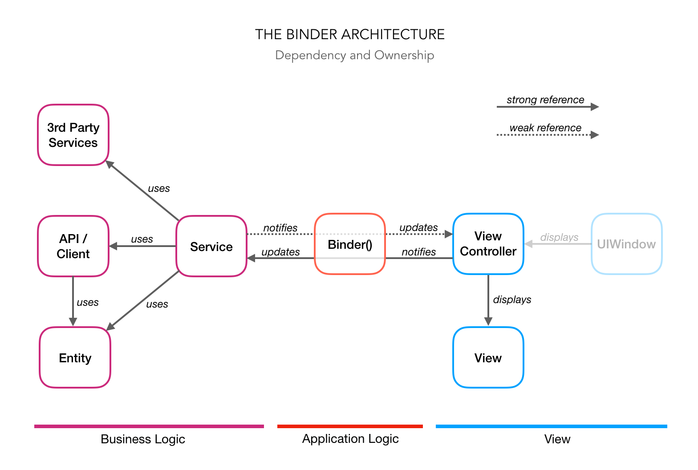
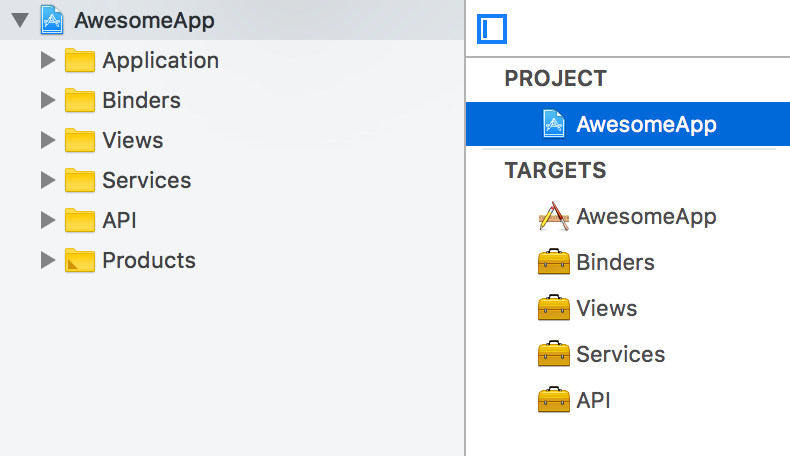

# The Binder Architecture

The Binder Architecture is a declarative architecture for iOS development inspired by MVVM and VIPER. It is an attempt to take the best ideas of MVVM and VIPER and implement them without the boilerplate code that the two architectures, especially the latter, suffer from. 

The central idea of the Binder architecture is implementing application logic as a function, as opposed to an object. In place of the ViewModel or Presenter, The Binder Architecture defines a function called *the binder*. Such approach enforces declarative application logic that provides all the benefits of declarative paradigm and results in a significant reduction of the boilerplate code that can be found in MVVM and VIPER.

## Overview



The architecture defines three main layers:

1. **Business logic** layer represents all the code that defines *what the app can do and how to do it*. It can be comprised out of many first or third party components. It exposes all of its functionality to other layers of the architecture through a number of components called *Services*.
2. **Application logic** layer represents a bridge between the business logic and the view. It knows when and how to presents the UI, loads the data using the business logic services, formats the data for the display, displays the data using the view and handles users actions by notifying appropriate Services. The central component of this layer is the *Binder* function.
3. **View** layer defines UI. It is a declarative layer comprised of *UIView* and *UIViewController* subclasses.

## Business Logic

Every good app provides some kind of a value to the user. Sometimes it does that by exposing a web service, sometimes by solving problems locally on the device and often by a combination of the two.

An app can communicate with web APIs, different business services, databases or other data persistence solutions, system services or device sensors and various other things. All of those will have their entities, managers and other kinds of types and objects. A code that interacts with them and builds on top of them is often referred to as the *business logic*. That is the bottom-most layer of our architecture.

One could write a book on how to properly implement the business logic layer and even that might not be enough. Thankfully there is a simple rule of thumb that we can use to define boundaries of the layer: imagine that we are making a cross-platform app (i.e. an app that can run on iOS, Android, TV, watch and/or desktop) and ask ourselves: “What is the code that can be shared across all of the platforms?” The answer is the code of the business logic layer.

The business logic layer exposes its functionality through a number of Services. Each Service is responsible for its own concern. For example, a webshop app could have `ProductService`, `ProductSearchService`, `CartService`, `CheckoutService`, etc. A `CartService` would represent a cart and be able to manage it by providing methods like `addProduct`, `removeProduct`, `empty`, etc. 
The Services would be accompanied by the Entities they work on like `Product`, `Cart`, `User`, etc. It is recommended to model those as value types like structs and enums when possible.

Here is a simple example of an entity and a service.

```swift
public struct User {
    public let name: String
    public let imageUrl: URL
    ...
}

public class UserService {
    
    public let user: User
    public let friends: LoadingSignal<[User], ApplicationError>
    ...
    
    public func logOut()
    public func addFriend(_ user: User) -> LoadingSignal<Void, ApplicationError>
    ...
}
```

We are showing only the public interface, not the implementation. It probably communicates with some web API and it might use CoreData for the persistance, but we don’t really care about its implementation. We only need to know that it represents our business logic on top of which we are building our app.
Now, you have probably noticed the *Signal* type there. We will be using [ReactiveKit](https://github.com/DeclarativeHub/ReactiveKit) and [Bond](https://github.com/DeclarativeHub/Bond) to demonstrate functional reactive aspects of the architecture, but other solutions will work well too.

## View

View displays content and UI to the user. It is responsible for layout, style and dynamic aspects of UI like rotations, animations, etc. The View is mostly built declaratively by leveraging Storyboards, writing declarative Auto Layout code, using declarative layout and styling frameworks or a combination of those.

On iOS, we usually build View layer out of `UIView` family of classes which we structure within `UIViewController` subclasses. One can think of `UIViewController` as the top-most view of the view hierarchy. It can present that hierarchy in a modal, tab, navigational or some other context. Our `UIViewController` subclasses, thus, belong to the View layer. 

Here is an example of a View Controller. We need not go into the details of implementing one in order to define our architecture. All we care for now is its public interface.

```swift
public class ProfileViewController: UIViewController {
    public let nameLabel: UILabel
    public let imageView: UIImageView
    public let friendsView: UICollectionView
    public let logoutButton: UIButton
}
```

Note that there are no dependencies to other layers of the architecture, nor does it implement actions like `didTapLogoutButton`. We are not going to add those later!

We shall treat View Controller as another View, but properly this time. Of course we will be subclassing `UIViewController` to define its view structure and other View-related aspects like in the example, but we will not be taking any dependencies, loading data or even handing actions from the subclass. We will do that from the “outside”.

## Application Logic

I am sure you could think of a number of ways to connect our Service and our View. You could go with MVC, you could introduce `ProfileViewModel` or go full in with VIPER. All those solutions would, however, require us to modify the View Controller. We would need to add `viewModel` or `interactor` property and handle `didTapLogoutButton` in the `ProfileViewContoller`. We, of course, are not going to do that because we need to respect the `ProfileViewController` and treat it as a View layer. We are not going to touch its implementation. Instead, we will say hello to the Binder!

### Binder

How does one then connect the business logic (Service) and the View (or View Controller) without touching their implementations at all? It took me more than a year to figure that out. The irony is that we were all already doing it. We were doing it with `UIButton`, with `UILabel` and with other views.

```swift
extension ProfileViewController {
    
    func makeLogoutButton() -> UIButton {
        let button = UIButton(type: .system)
        button.setTitle("Log out", for: .normal)
        return button
    }
}
```

Sometimes we did it in a method like above, sometimes as a lazy property, but the pattern is always the same: instantiate the view, configure it and return it. Why have we never done the same for `XYZViewController` that we said we are going to treat like any other View. Why have we failed to see the pattern.

Let us, however, try doing that as an experiment. We will start by defining a function that instantiates the View Controller and returns it.

```swift
extension ??? {

    func makeViewController() -> ProfileViewController {
        let viewController = ProfileViewController()
        // ...configure viewController...
        return viewController
    }
}
```

Just as in our button example, we have a function that now creates the view controller, configures it and returns it. Before we proceed to the implementation, let us think for a while what type should that extension be defined on.

Our example function that makes the button is defined on the view controller (or in its extension) because the view controller is the one that instantiates the button. Following the same principle, the function that makes the view controller could be defined on a type which will be instantiating the view controller. However, since a view controller can be instantiated from many places, it would be wasteful to have each such place implement the same *make* function. A better way would be to implement it at only one place — on the view controller itself, now of course as a static function.

```swift
extension ProfileViewController {

    static func makeViewController() -> ProfileViewController {
        let viewController = ProfileViewController()
        // ...configure viewController...
        return viewController
    }
}
```

One can do the same for views, too. If there is a button that repeats throughout the app and which does not require a subclass, we can implement it as a static *make* function on the `UIButton` itself.

Let us continue with the experiment. Now that we have a function that creates the view controller, how do we actually make it do the stuff it was meant to do. We want it to display the user data represented by the user service. We can try passing in the service and see what can we do with it.

```swift
extension ProfileViewController {

    static func makeViewController(_ userService: UserService) -> ProfileViewController {
        let viewController = ProfileViewController()

        viewController.nameLabel.text = userService.user.name
        viewController.imageView.imageUrl = userService.user.imageUrl  // Assuming using an image caching libary
        
        userService.friends
            .consumeLoadingState(by: viewController.friendsView)  // Show the loading indicator on friendsView 
            .bind(to: viewController.friendsView) { cell, friend in
                cell.nameLabel.text = friend.name
            }

        // ...
        
        return viewController
    }
}
```

What the heck — did we just fill the data  in. It is like our button example, now configuring the View Controller. Awesome!

There are two cases regarding the data. The data that is available *at the binding time* can be just **assigned** to the View Controller, while the data that is available *asynchronously* should be **bound** to the View Controller (or its subviews).

We are making functional reactive programming a first-class citizen here. No longer it serves the function of communication channel between the View and the  View Model. Now we are directly binding the reactive business logic data of the business logic layer to the View while at the same time we keep those layers completely oblivious of each other. The only piece of code that is aware of both layers is this one function.

Business logic layer data and events flow from the Service to the View Controller, while user actions and user input flow from the View Controller to the Service. We have solved the problem of Service data flow by assignments and bindings, but how do we handle user action and user input? How do we make tapping the *Log Out* button call `logOut` function on the `UserService`? Well, since we are leveraging functional reactive programming and making it a first-class citizen, there is really no problem to solve there. Just make function of a service an observer of the user action or user input.

```swift
extension ProfileViewController {

    static func makeViewController(_ userService: UserService) -> ProfileViewController {
        let viewController = ProfileViewController()

        viewController.nameLabel.text = userService.user.name
        viewController.imageView.imageUrl = userService.user.imageUrl  // Assuming using an image caching libary
        
        userService.friends
            .consumeLoadingState(by: viewController.friendsView)  // Show the loading indicator on friendsView 
            .bind(to: viewController.friendsView) { cell, friend in
                cell.nameLabel.text = friend.name
            }

        viewController.logoutButton.reactive.tap
            .observeNext(with: userService.logOut)
            .dispose(in: viewController.bag)
        
        return viewController
    }
}
```

Is that it? Yes — that is our View Model destroyer! Who would have thought it would be just a function, but as we learned from the experiment it turns out that we do not really need another type between the business logic layer (the Model layer if you will) and the View.

I like to call this function **the Binder** because it binds two architectural layers together. The example we built is a template that can scale no matter how the Service or the View Controller are complex as long as you follow the three rules we empirically deduced:

1. **Assign** Service data that is available at *the binding time* to the View Controller
2. **Bind** Service data or events that are available *asynchronously* (as Signals/Observables) to the View Controller
3. **Observe** user actions or user input from the View Controller with the *instance methods* of the Service

With those three rules you can implement any Binder, i.e. connect any Service to any View Controller. Through those three rules you express  your applications logic — what loads when, what displays where, what formats how, etc. It really is as simple as that.

## Navigation (Routing)

When thinking about app navigation, we must ask ourselves two questions: 

1. Who initiates the navigation?
2. Who performs the navigation?

Navigation is most commonly initiated by the user tapping a button or performing some other action. Alternatively, navigation can be triggered by an event from the business logic. A code that handles both user actions and business logic events is the application logic code - in our case the binder function. That answers the first question.

The answer to the second questions should already be known to those familiar with UIKit. It is view controllers that perform navigation. View controllers present other view controllers. They present them in a navigation stack in case of UINavigationController, in a tab container in case of UITabBarController, modally in case of calling `present` method or in some other built-in or custom way.

Binders both implement the application logic and create view controllers. Does that mean that they should also implement the navigation? The answer is yes, however, there is a couple of ways to do it.

Let us say that our `ProfileViewController` has a button that should open a view controller where the user can edit their profile. We can implement such navigation in the following way:

```swift
extension ProfileViewController {

    static func makeViewController(_ userService: UserService) -> ProfileViewController {
        ...
        viewController.editProfileButton.reactive.tap
            .bind(to: viewController) { viewController in 
                let editProfileVC = EditProfileViewController.makeViewController(userService)
                viewController.present(editProfileVC, animated: true)
            }
        ...
    }
}
```

We observe button tap evens with a binding and present the new view controller when the event occurs. Simple.

#### Dependency Pyramid Problem

`EditProfileViewController` has the same dependency as `ProfileViewController` - `UserService`. However, what if that was not the case? What if the view controller that we are about to present has some other dependency unknown to `ProfileViewController`? Let us consider something like the navigation to a friend list that depends on an arbitrary `FriendsService`. Following the same approach

```swift
extension ProfileViewController {

    static func makeViewController(_ userService: UserService) -> ProfileViewController {
        ...
        viewController.friendsButton.reactive.tap
            .bind(to: viewController) { viewController in 
                let friendService = ???
                let friendsViewController = FriendsViewController.makeViewController(friendService)
                viewController.navigationController?.pushViewController(friendsViewController, animated: true)
            }
        ...
    }
}
```

we would end up in a trouble. Where do we get `friendService` from? Passing it to binder (to the `makeViewController`) is a bad idea. `ProfileViewController` does not use it so it would be redundant. Could we just make `FriendsService` a singleton? No, singletons are out of the question!

This is a classic dependency injection problem. A dependency injection framework could help, but that would not be fun. We can actually solve this ourselves.

A basic solution would be to make services create another services. For example, our `UserService` could have a method `makeFriendsService()` that creates and returns a `FriendService`. This would be a fine solution for a simple app or for a related services (for example if they are in a parent-child relationship), but in the more complex projects we would end with many services being able to create many other unrelated services.

A general solution is to have a dependency provider and pass that to the binders. A dependency provider is just a top level service (the peek of our pyramid) like a session object or another object that owns or makes dependencies. Here is an example:

```swift
class Session {
    
    // Session usually owns the client as it know about authentication
    let client: APIClient
    
    // Session can own services that are alive as long as the app is alive
    let currentUserService: UserService
    ...
    
    // Session can create other services when needed
    func makeFriendsService(for user: User) -> FriendsService 
    ...
}
```

We can then refactor our example to use the `Session` object.

```swift
extension ProfileViewController {

    static func makeViewController(_ session: Session) -> ProfileViewController {
        let userService = session.currentUserService
        
        ...
        
        viewController.friendsButton.reactive.tap
            .bind(to: viewController) { viewController in 
                let friendsViewController = FriendsViewController.makeViewController(user: userService.user, session: session)
                viewController.navigationController?.pushViewController(friendsViewController, animated: true)
            }
        ...
    }
}
```

`FriendsViewController` binder would then call session's `makeFriendsService` method with the given user to get the service it requires.

Make sure to check out the [demo app](https://github.com/DeclarativeHub/AbsurdGitter) for a working example.

## Discussion

### Ownership

Who owns the Services and other business logic layer objects? Turns out that nobody has to own them explicitly. There are three cases to consider:

1. *A service provides only static data*. In this case, after we assign the data at the binding time, we no longer need the service so it can be released and destroyed as far as we are concerned.

2. *A service provides asynchronous data or events*. We are assuming that this kind of data will be provided by Signals/Observables. Since those will be bound to the View Controller and bindings retain the Signals while the binding target (View Controller) is alive, we again need not care about the ownership. Relevant objects will be retained as long as the View Controller lives.

3. *A service handles user actions or accepts user data*. We said earlier that we will be observing that kind of data with the Services’ instance methods. Signals/Observables retain their observers which are in our case the Service instance methods so that will in turn retain the Service itself. We will always put the observation disposable in the View Controller’s dispose bag to ensure  that the observation is disposed when the View Controller is deallocated.

You might ask yourself why don’t we bind user actions and user input to the Service. The reason is that bindings, as opposed to the observations, do not retain their targets. We need the Service alive when action happens - case #3.

### Massive Binders

When the View Controller presents a lot of data and handles a lot of user input and actions, the Binder function will naturaly grow. This might be scary, but it is actually not a problem. Here is why.

1. The binder is a declarative piece of code. There is no state in it so the complexity does not increase with a new line of code. Each line, i.e. an assignment, a binding or an observation is independent  with the respect to others. You should be able to completely shuffle their order and the Binder behaviour should remain unchanged.
2. Like any function, you can split it into more smaller functions. Every observation or binding closure that is longer than a couple of lines of code can be extracted into a separate function.

### Structuring Xcode Project



The Binder function and related helper functions should live in their own file! I would actually recommend developing every layer of the architecture as a separate framework (target).

Here is an example of simple structure that makes use of frameworks for each layer. The bottom-most layer, the business logic, is implemented by frameworks like API and Services.

The app also needs the View, or the user interface. We can put that in separate framework called Views. `UIView` subclasses, as well as `UIViewController` subclasses, would live there.

On top of the business logic layers and View layer there will be our Binder layer. That is where all the Binder functions will live. You would put each binder into a separate file. You will usually have one Binder file for each View Controller.

On top of everything is the Application itself. It will contain the App Delegate and nothing else. The app delegate would import Binders and use the application’s root view controller Binder to instantiate the root view controller.

### Reactive Libraries

This architecture should be a great fit for all major functional reactive libraries. 

With [RxSwift](https://github.com/ReactiveX/RxSwift) one could leverage Observables and Drivers in their Services and Binders. RxCocoa provides a great collection of bindings and reactive extensions to handle user actions and user input. 

[ReactiveSwift](https://github.com/ReactiveCocoa/ReactiveSwift/) with [ReactiveCocoa](https://github.com/ReactiveCocoa/ReactiveCocoa/#readme) is another great solution. Although it provides hot and cold signal distinction that this architecture does not require, it would be interesting to see Binders built on top of it.

The reason I am blatantly promoting [ReactiveKit](https://github.com/DeclarativeHub/ReactiveKit) and [Bond](https://github.com/DeclarativeHub/Bond) in this article is that I am the author of the two. They are by no means a requirement for this architecture, but they do offer some perks like safe signals, bindings that automatically handle threading, [inline bindings](https://github.com/DeclarativeHub/ReactiveKit#bindings), [loading signals](https://github.com/DeclarativeHub/ReactiveKit#loading-signals) that enable simple loading state side effects and [observable collection](https://github.com/DeclarativeHub/Bond#observablearray--mutableobservablearray) with out of the box diffing. As I have been evolving the Binder architecture over time, so were the two libraries shaped to make them perfect fit for the architecture.

### Is This a New Architecture?

Yes and no. Although it required some thinking and a lot of experimentation before I came up with it, the architecture seems to be a variation of [Model-View-Adapter](https://en.wikipedia.org/wiki/Model–view–adapter) where the Binder takes place of the Adapter. The Binder, conceptually, is the Adapter because it solves the same problem with the same constraints, however, our Binder is a function —  not a traditional object like the Adapter.

Since the Binder binds two layers of the architecture together and because it does that by leveraging reactive bindings, I think it is given the right name.

### Is There a Demo Project?

Yes! Check out [AbsurdGitter](https://github.com/DeclarativeHub/AbsurdGitter). 

## Conclusion

Thank you for reading this. I would love to hear you feedback, no matter if you love it or if you have some concerns. Feel free to open an issue or make a pull request.
